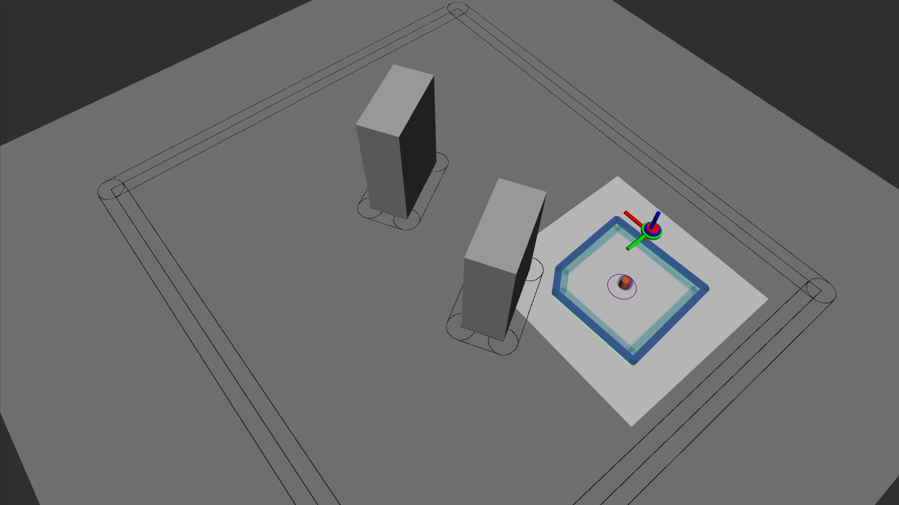

# hmpc

[](https://opensource.org/licenses/MIT)
[](https://arxiv.org/abs/2406.11506)


## Submission
A reference implementation of the embedded MPC framework used in our submission [Embedded Hierarchical MPC for Autonomous Navigation](https://arxiv.org/abs/2406.11506).\
Paper: https://arxiv.org/pdf/2406.11506. \
Video: https://youtu.be/0RnrKk6830I.

```bibtex
@inproceedings{benders2024arxiv,
    title     = {Embedded Hierarchical MPC for Autonomous Navigation},
    author    = {Benders, Dennis and K{\"o}hler, Johannes and Niesten, Thijs and Babu\u{s}ka, Robert and Alonso-Mora, Javier and Ferranti, Laura},
    journal   = {arXiv},
    year      = {2024},
    url       = {https://arxiv.org/abs/2406.11506}
}
```


## Teaser
In this work, we compare the performance of a single-layer MPC (SMPC) with a hierarchical MPC (HMPC) framework in simple simulations (without model mismatch), Gazebo simulations and lab experiments. The animation below shows the HMPC framework operating in the lab:



The quadrotor platform used for the lab experiments is the following:


Interested in trying out our method? Follow the instructions below to get started!


## How to get started?
Clone this repository by running:
```
git clone --recurse-submodules git@github.com:dbenders1/hmpc.git
```
and follow the instructions in the [src README](./src/README.md).


## Contact information
If you have any questions, feel free to reach out via https://github.com/dbenders1.
